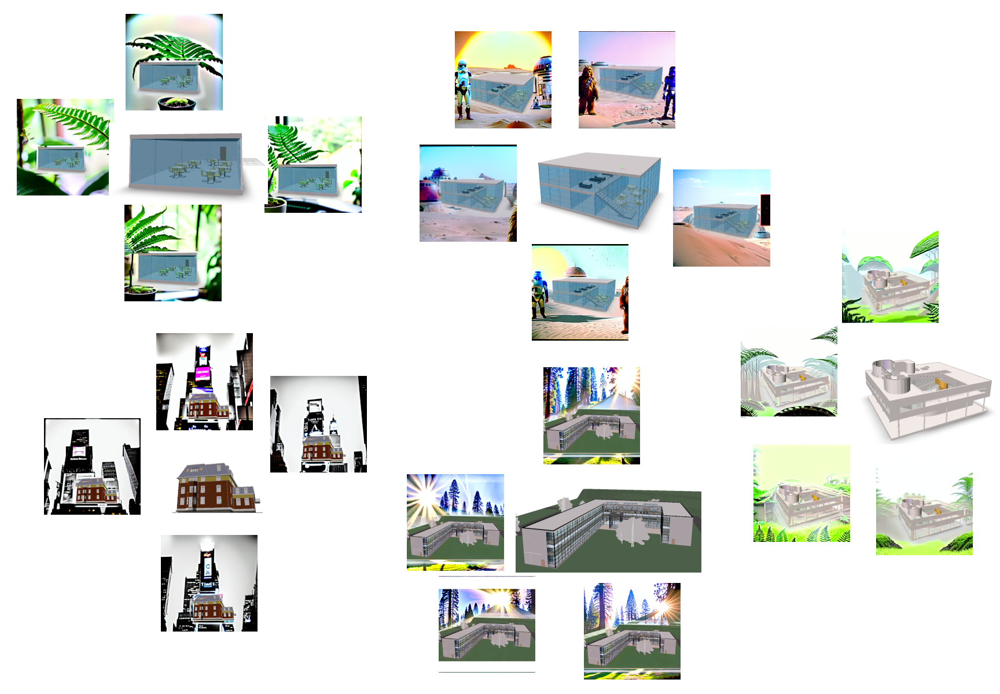
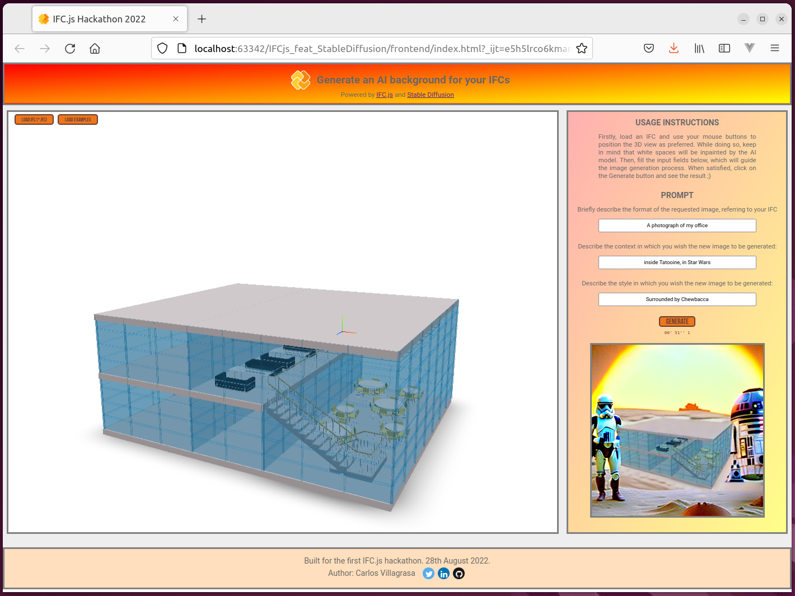

# IFC.js *feat* Stable Diffusion

Welcome to the repository of my project for the 
[IFC.js Crash Course](https://ifcjs.github.io/info/docs/Courses/Crash-course/) 2022, which aims to generate an AI 
background over a view of your IFC files. 

The course has been an incredible journey,
from basic web programming, to high level BIM libraries, going through vanilla *JavaScript* and *three.js*, 
as well as the necessary tooling. 
The initial goals established for this final project were:

-To build and deploy a BIM application using either [*web-ifc-three*](https://github.com/IFCjs/web-ifc-three) 
or [*web-ifc-viewer*](https://github.com/IFCjs/web-ifc-viewer).

-To solve the final course exercise (BIM catalogue), or develop any other insightful idea. 

In parallel to the course, during these recent weeks there has been a hectic release after 
another of generative image models using AI. Indeed, 
[Stable Diffusion has very recently open sourced](https://stability.ai/blog/stable-diffusion-public-release), getting
SOTA mindblowing results.

Even if the official version of the model only supports direct inference and image to image, there have also been 
[super-recent approaches](https://twitter.com/Gradio/status/1562827932871303170) to use the model for inpainting. 
This is the technique in which an image is provided by the user, along with a given mask indicating which parts are 
allowed to be overwritten by the Neural Network, and which parts are not. The result can often be the contextualization 
of a given set of objects from our picture, in a totally different environment completely created by the Deep Learning 
model.

Hence, joining these two milestones, I thought that a proof-of-concept website using both *IFC.js* and
*Stable Diffusion* could be a nice idea to develop.

The backend consists of a set of *Python* scripts using *PyTorch*, which have been adapted to be called from a
simple *Flask* server. The mask is automatically obtained from the background of the provided image, so there is
no need for the user to have to draw it on some kind of canvas.

As for the frontend, the resulting web application is
[deployed in GitHub Pages](https://cvillagrasa.github.io/IFCjs_feat_StableDiffusion/frontend/index.html),
and consists of a *web-ifc-viewer* container prepared to load and position at will any IFC file, to then fill 
some text prompt fields asking for the desired background, and finally submit the request. At this point,
the *three.js* scene is serialized and sent as a POST request to the backend server, altogether with the prompt.

It is worth mentioning that on an 8GB VRAM consumer GPU, the backend takes over 50 seconds to generate the new image. 
It's definitely not instant, but we must bear in mind that these kind of models are really big. In fact, *Stable Diffusion* is by far one of the least
hardware demanding SOTA models. Presumably, in years to come, both quality and speed of such AI workflows will continue 
improving.

**Note:** Please, read the [model card](https://huggingface.co/CompVis/stable-diffusion-v1-4) to know
what kind of bias and limitations can the model have. Use prompt-engineering responsibly. For more information on 
possible concerns when using Deep Learning, please refer to 
[the Data Ethics chapter of Fast.ai](https://ethics.fast.ai/).

